# Guess A Number App
## An Simple app to play a number guessing game with phone
## Functionality of App
- View categories of foods or meals
- View List of specific category of meals
- View details about specific meal
- Star and save favourite meal
- Filter and save filtered meals based on categories (Gluten-free, Lactose-free, Vegan, Vegetarian) 
```diff
# Main Menu Categories (Android & iOS)
```
<p align="center">
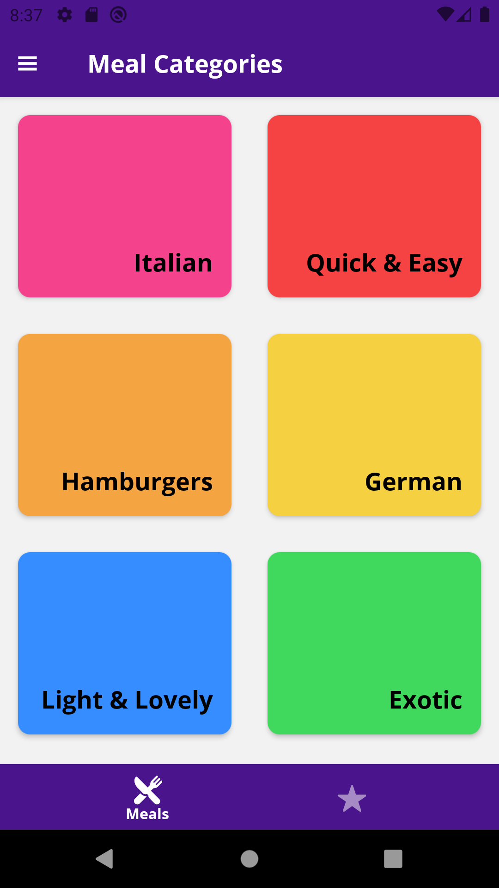
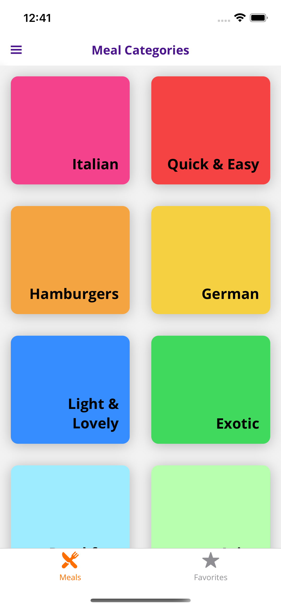
</p>

```diff
# Quick & Easy Menu(Android & iOS)
```
<p align="center">
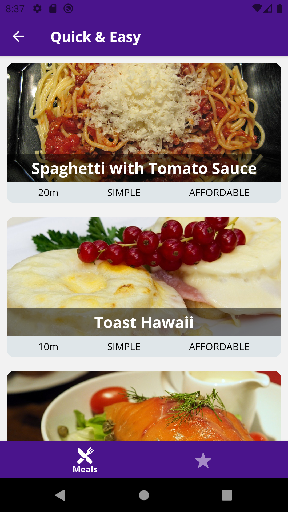
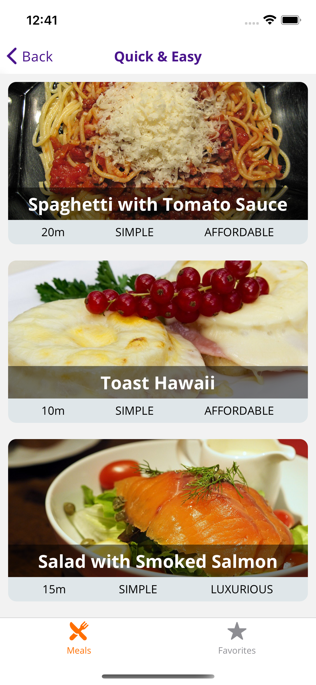
</p>

```diff
# Meal Details (Android & iOS)
```
<p align="center">
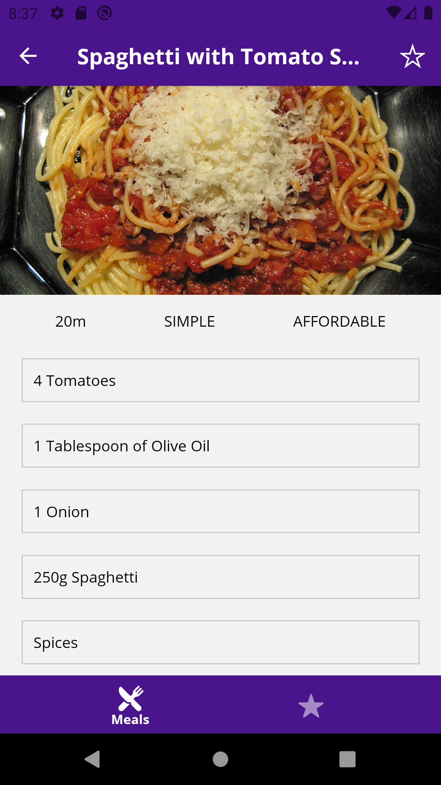
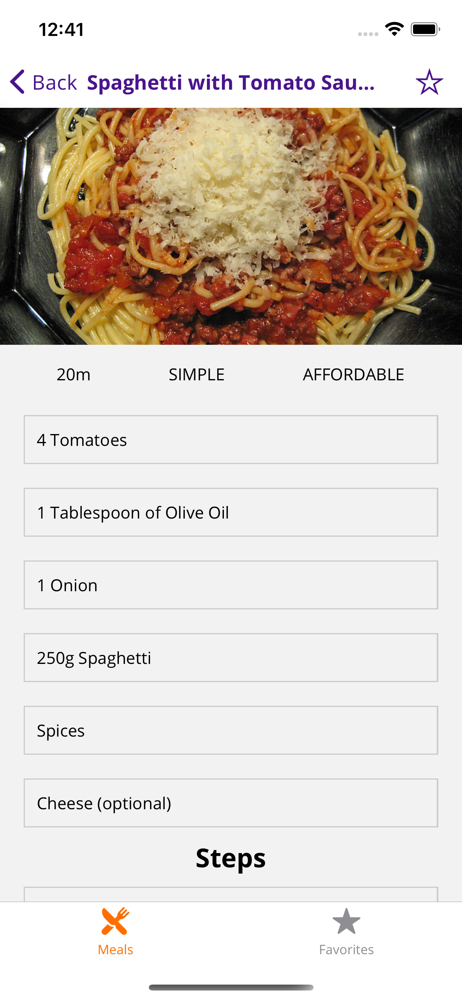
</p>

```diff
# Drawer Menu (Android & iOS)
```
<p align="center">
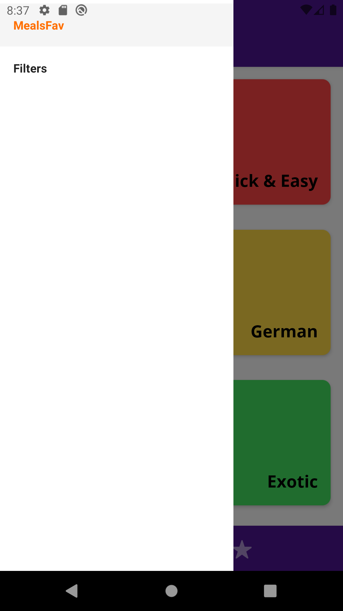
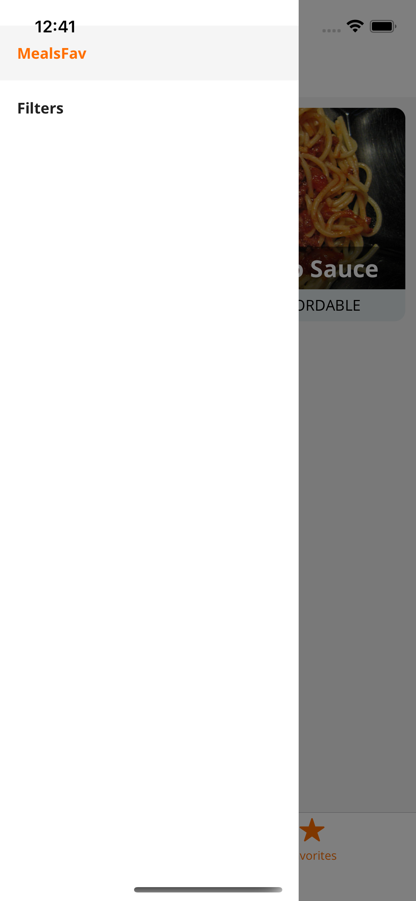
</p>

```diff
# Favourite Meal (Android & iOS)
```
<p align="center">
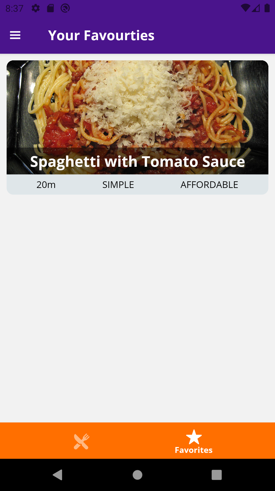
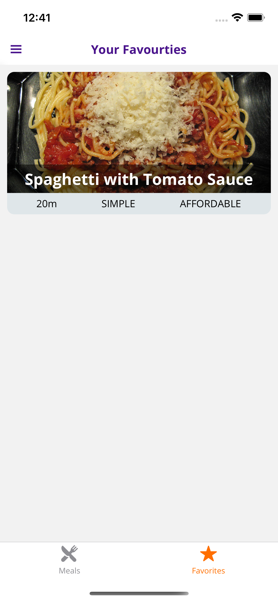
</p>

```diff
# Filter Screen (Android & iOS)
```
<p align="center">
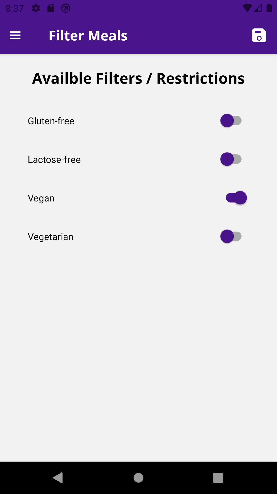
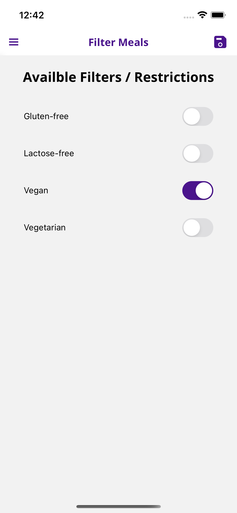
</p>

## Sample Implementation
- Navigation with React Navigation (StackNavigator, TabNavigator, DrawerNavigator)
- Outputing a Grid of Categories (Grid Styling)
- Adding local Models & Data
- Adding Header & Menu Button
- Adding MaterialBottomTabs
- useEffect() & useCallback()
- State Management & Redux